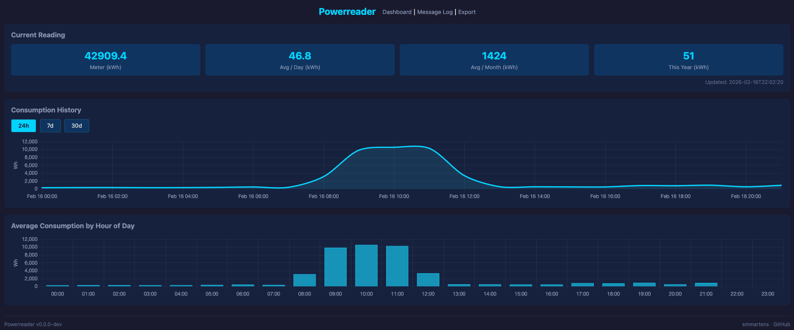

#  powerreader

A self-hosted power consumption monitor that subscribes to MQTT messages from a Tasmota-flashed ESP32C3 connected to a smart power meter, stores readings in SQLite, computes consumption analytics, and serves a web dashboard — all in a single Docker container.



## What's New in v1.1.0

- **Day-of-week consumption chart** — New dashboard widget showing average daily kWh per weekday (Sunday–Saturday), with the same from/to date filter as the hourly averages chart.
- **Consumption Records panel** — New dashboard panel with the top 5 highest and lowest consumption days, giving a quick view of your peak and off-peak days.
- **Date range filter for hourly averages** — The "Average Consumption by Hour of Day" chart now has from/to date pickers. Default range is your first recorded reading to today.

## Hardware

This project is built around a Tasmota-flashed ESP32C3 reading SML data from a smart meter. A ready-made device that works out of the box is the [Stromleser](https://stromleser.de/) — a compact ESP32-based SML reader that attaches to your meter's optical interface and publishes readings via MQTT. No soldering or custom firmware required.

Any Tasmota-compatible device that publishes SML or ENERGY data via MQTT will work.

## Features

- Real-time power monitoring via MQTT (Tasmota SML/ENERGY format)
- SQLite storage with automatic hourly and daily aggregation
- Configurable raw data retention with automatic pruning
- REST API for current readings, history, and averages
- Web dashboard with Chart.js visualizations (24h/7d/30d history, hourly and weekday averages, consumption records)
- Downsample mode to reduce storage (store every message or 1/min)
- Multi-meter ready via `device_id` column
- CSV data export with custom date ranges
- Single-container deployment with Docker

## Quick Start

1. Create a directory and download the deployment files:
   ```bash
   mkdir -p powerreader && cd powerreader
   curl -LO https://raw.githubusercontent.com/smmartens/powerreader/main/docker-compose.prod.yml
   curl -LO https://raw.githubusercontent.com/smmartens/powerreader/main/mosquitto/mosquitto.conf
   ```

2. Start the stack:
   ```bash
   docker compose -f docker-compose.prod.yml up -d
   ```

3. Configure your Tasmota device to publish to the Mosquitto broker at `<host-ip>:1883`.

4. Open the dashboard at [http://localhost:8080](http://localhost:8080).

### Updating

```bash
docker compose -f docker-compose.prod.yml pull
docker compose -f docker-compose.prod.yml up -d
```

### Building from source

Alternatively, clone the repository and build locally:
```bash
git clone https://github.com/smmartens/powerreader.git
cd powerreader
docker compose up -d
```

## Configuration

All configuration is via environment variables (set in `docker-compose.yml` or `docker run -e`):

| Variable | Default | Description |
|---|---|---|
| `MQTT_HOST` | `localhost` | MQTT broker address |
| `MQTT_PORT` | `1883` | MQTT broker port |
| `MQTT_USER` | `""` | MQTT username |
| `MQTT_PASS` | `""` | MQTT password |
| `MQTT_TLS` | `false` | Enable TLS for the MQTT broker connection |
| `MQTT_TLS_CA` | `""` | Path to CA certificate file (optional, uses system CAs if empty) |
| `MQTT_TOPIC` | `tele/+/SENSOR` | MQTT topic to subscribe |
| `DB_PATH` | `/data/powerreader.db` | SQLite database path |
| `POLL_STORE_MODE` | `all` | `all` = store every message, `downsample_60s` = 1/min |
| `RAW_RETENTION_DAYS` | `30` | Days to keep raw readings |
| `WEB_PORT` | `8080` | Dashboard port |
| `FIELD_MAP` | `""` | Custom MQTT field mapping (comma-separated `key=path` pairs, e.g. `total_in=SML.Total_in,power_w=SML.Power_curr`). Empty = LK13BE defaults. |
| `ALLOWED_DEVICES` | `""` | Comma-separated allowlist of device IDs (e.g. `tasmota_ABC123,tasmota_DEF456`). Empty = accept all devices. |

## How the Calculation Works

Powerreader derives all consumption data from a single meter value: **`total_in`** — the cumulative energy counter (kWh) that every smart meter exposes by default. No meter PIN code is required. While a PIN would unlock additional real-time values like instantaneous power, voltage, and amperage per phase, these are not needed for consumption tracking.

The calculation is straightforward:

1. **Raw readings** are stored with the `total_in` value as reported by the meter (e.g. `42857.891 kWh`).
2. **Hourly aggregation** computes the energy consumed per hour as the delta between the highest and lowest `total_in` within that hour:
   ```
   energy_kwh = MAX(total_in) - MIN(total_in)
   energy_wh  = energy_kwh × 1000
   ```
   For a full 1-hour bucket, Wh and average Watts are numerically identical (`P = E / t = Wh / 1h = W`), so the same value serves as both "Wh consumed" and "average power in W" on the dashboard.
3. **Daily aggregation** sums the hourly kWh deltas for total daily consumption, and averages the hourly values for average daily power.
4. **Consumption stats** (avg per day, per month, this year) are derived from the daily aggregates and the overall `total_in` delta.

## Architecture

```
                            ┌─────────────────── Docker Compose ───────────────────┐
                            │                                                       │
┌──────────────┐   MQTT     │  ┌─────────────┐                                     │
│ Tasmota       │───────────┼─▶│ Mosquitto   │                                     │
│ ESP32C3       │           │  │ :1883       │    powerreader container             │
│ (smart meter) │           │  └──────┬──────┘   ┌────────────────────────────────┐ │
└──────────────┘           │         │           │                                │ │
                            │         ▼           │  ┌──────────┐  ┌────────────┐ │ │
                            │  ┌─────────────┐    │  │Aggregation│─▶│ SQLite DB  │ │ │
                            │  │ MQTT        │────┼─▶│Scheduler  │  │            │ │ │
                            │  │ Subscriber  │    │  └──────────┘  │-raw_readings│ │ │
                            │  └─────────────┘    │                │-hourly_agg  │ │ │
                            │                     │  ┌──────────┐  │-daily_agg   │ │ │
                            │                     │  │ FastAPI   │──│-mqtt_log    │ │ │
                            │                     │  │ + Web UI  │  └────────────┘ │ │
                            │                     │  │ :8080     │                 │ │
                            │                     │  └──────────┘                  │ │
                            │                     └────────────────────────────────┘ │
                            └───────────────────────────────────────────────────────┘
```

## API Endpoints

| Method | Path | Description |
|---|---|---|
| `GET` | `/health` | Health check |
| `GET` | `/` | Web dashboard |
| `GET` | `/api/current?device_id=meter1` | Latest reading for a device |
| `GET` | `/api/history?range=24h&device_id=meter1` | Time-series data (`24h`, `7d`, `30d`) |
| `GET` | `/api/averages?from_date=2024-01-01&to_date=2024-01-31&device_id=meter1` | Average power by hour of day across a date range (defaults: earliest date → today) |
| `GET` | `/api/weekday_averages?from_date=2024-01-01&to_date=2024-01-31&device_id=meter1` | Average kWh per day of week (0=Sun…6=Sat) across a date range |
| `GET` | `/api/records?device_id=meter1` | Top 5 highest and lowest consumption days |
| `GET` | `/api/stats?device_id=meter1` | Consumption statistics (avg/day, avg/month, this year, coverage) |
| `GET` | `/api/log?limit=200` | MQTT message log (most recent first) |
| `GET` | `/api/export?start=2024-01-01&end=2024-01-31&report=hourly` | CSV data export |
| `GET` | `/api/version` | Application version |
| `GET` | `/log` | Message log page |
| `GET` | `/export` | Export page |

## CSV Export

The export page (`/export`) lets you download power consumption data as a CSV file for a custom date range.

**Available reports:**

| Report | Description | Columns |
|---|---|---|
| `hourly` | Average consumption by hour of day (0–23), aggregated across all days in the range | `hour_of_day`, `avg_power_w`, `total_kwh`, `reading_count`, `days_covered`, `avg_coverage_seconds` |

**API usage:**

```
GET /api/export?start=2024-01-01&end=2024-01-31&report=hourly
```

Returns a CSV file download. The `device_id` parameter is optional — if omitted, the most recently active device is used. The date range is capped at 10 years.

**Example output:**

```csv
hour_of_day,avg_power_w,total_kwh,reading_count,days_covered,avg_coverage_seconds
0,185.3,5.559,930,31,3540
1,172.1,5.163,930,31,3540
...
23,195.8,5.874,930,31,3540
```

## Security

Powerreader is designed for trusted local networks but includes several hardening measures:

- **Input sanitization** — MQTT payloads are validated and truncated before storage (timestamps, device IDs, topics). Invalid timestamps are rejected.
- **XSS protection** — All dynamic values in the web UI are HTML-escaped before rendering.
- **Security headers** — Responses include `Content-Security-Policy`, `X-Frame-Options: DENY`, `X-Content-Type-Options: nosniff`, and `Referrer-Policy`.
- **SQL injection** — All database queries use parameterized statements.
- **Non-root container** — The Docker image runs as an unprivileged user (`appuser`, UID 1000).
- **MQTT TLS** — Optional encrypted connection to the MQTT broker. Set `MQTT_TLS=true` and optionally provide a CA certificate via `MQTT_TLS_CA`.
- **MQTT authentication** — Set `MQTT_USER` and `MQTT_PASS` to authenticate with the broker. Configure matching credentials on the Tasmota device under MQTT settings.
- **Device allowlist** — Set `ALLOWED_DEVICES` to restrict which device IDs are accepted. Messages from unknown devices are silently dropped before any database write.
- **API parameter clamping** — Query parameters like `limit` and `days` are clamped to safe ranges to prevent resource exhaustion.

### MQTT TLS

To encrypt MQTT traffic between all clients and the broker:

1. Enable TLS on the Tasmota device (MQTT configuration page, check "TLS").

2. Configure Mosquitto with a TLS listener (e.g. using Let's Encrypt or a self-signed CA):
   ```
   listener 8883
   certfile /mosquitto/certs/server.crt
   keyfile /mosquitto/certs/server.key
   cafile /mosquitto/certs/ca.crt
   ```

3. Set the powerreader environment:
   ```yaml
   environment:
     MQTT_HOST: mosquitto
     MQTT_PORT: 8883
     MQTT_TLS: "true"
     # MQTT_TLS_CA: /certs/ca.crt  # only needed for self-signed CAs
   ```

4. If using a custom CA, mount the certificate into the container:
   ```yaml
   volumes:
     - ./certs/ca.crt:/certs/ca.crt:ro
   ```

### Mosquitto Broker ACLs

For additional protection, configure your MQTT broker to restrict which clients can publish to sensor topics. An example ACL configuration is provided in `mosquitto/mosquitto.acl.example`. To enable it:

1. Create a password file for your MQTT users:
   ```bash
   docker exec mosquitto mosquitto_passwd -c /mosquitto/config/passwd tasmota
   docker exec mosquitto mosquitto_passwd /mosquitto/config/passwd powerreader
   ```

2. Copy and customize the ACL file:
   ```bash
   cp mosquitto/mosquitto.acl.example mosquitto/mosquitto.acl
   ```

3. Update `mosquitto/mosquitto.conf`:
   ```
   listener 1883
   allow_anonymous false
   password_file /mosquitto/config/passwd
   acl_file /mosquitto/config/mosquitto.acl
   ```

4. Set `MQTT_USER` and `MQTT_PASS` in your powerreader environment to match the `powerreader` broker user.

## Development

```bash
# Install dependencies
uv sync

# Run locally
uv run uvicorn powerreader.main:app --reload --host 0.0.0.0 --port 8080

# Lint and format
uv run ruff check .
uv run ruff format .

# Install pre-commit hooks (runs ruff + full test suite before every commit)
uv run pre-commit install
```

### Testing

The test suite uses **pytest** with **pytest-cov**. An **80% coverage gate** is enforced — CI and pre-commit hooks both fail if coverage drops below this threshold.

**No external services required.** All tests run fully isolated:

- Database tests use an in-memory or temporary SQLite file per test — no running database needed.
- MQTT client interactions are mocked via `unittest.mock`.
- API tests use FastAPI's `TestClient` with the DB overridden to a temporary file.

**Test file naming** mirrors the source tree: `powerreader/db.py` → `tests/test_db.py`.

**Shared fixtures** (initialized DB, seeded data, sample MQTT payloads, API client) live in `tests/conftest.py`. Check there before creating new fixtures — the existing ones cover most common scenarios.

**When contributing a new feature**, add or extend the corresponding test file. Every public function in `powerreader/` should have test coverage.

```bash
uv run pytest                                        # all tests
uv run pytest tests/test_db.py                       # single file
uv run pytest -k "test_coverage"                     # single test by name
uv run pytest --cov=powerreader --cov-fail-under=80  # with coverage report
```

### Branching Strategy

This project uses **trunk-based development**:

- **`main`** is the single long-lived branch. All work lands here.
- Create short-lived **feature/fix branches** off `main` for each change (e.g. `fix/mqtt-reconnect`, `feat/tls-support`).
- Open a **pull request** to `main`. CI runs lint + tests on every PR.
- **Merge and delete** the branch once the PR is approved.
- No long-lived `dev` or `release` branches.

## Releasing

To publish a new version:

1. Update the version in `pyproject.toml`
2. Commit and push to `main`
3. Tag and push the release:
   ```bash
   git tag v1.1.0
   git push origin v1.1.0
   ```

The GitHub Actions release workflow automatically builds the Docker image and pushes it to `ghcr.io/smmartens/powerreader` with tags for the version (`v1.1.0`, `1.1`) and `latest`.

## License

MIT
